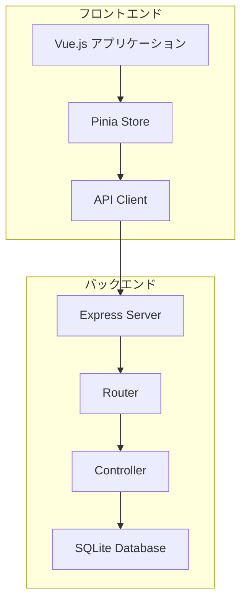

# 在庫管理システム

## 概要
シンプルな在庫管理システムです。商品の登録、在庫数の管理、在庫状況の可視化などの機能を提供します。

## 主な機能
- 商品管理（登録・編集・削除）
- 在庫数管理
- ダッシュボード
  - 総在庫数の表示
  - 商品数の表示
  - 総在庫金額の表示
- SKU（在庫管理番号）による商品管理
- カテゴリ別商品管理

## 技術スタック

### フロントエンド
- Vue.js 3 (Composition API)
- TypeScript
- Vite
- Tailwind CSS
- Pinia (状態管理)
- Vue Router
- Heroicons
- Headless UI

### バックエンド
- Node.js
- Express
- SQLite (better-sqlite3)
- Zod (バリデーション)

## システム構成図


## ドキュメント
- [API仕様書](./docs/api-spec.md)
- [ER図](./docs/er-diagram.md)
- [システムアーキテクチャ](./docs/architecture.svg)

## セットアップ方法

### フロントエンド
```bash
# 依存関係のインストール
npm install

# 開発サーバーの起動
npm run dev
```

### バックエンド
```bash
cd backend

# 依存関係のインストール
npm install

# 開発サーバーの起動
npm run dev
```

## 環境変数
### フロントエンド (.env)
```
VITE_API_URL=http://localhost:3000/api
```

### バックエンド (.env)
```
PORT=3000
DATABASE_URL=file:./inventory.db
```

## デプロイ
### フロントエンド (Netlify)
1. GitHubリポジトリと連携
2. ビルド設定:
   - Build command: `npm run build`
   - Publish directory: `dist`
3. 環境変数の設定:
   - `VITE_API_URL`: バックエンドのURL

### バックエンド (Render)
1. GitHubリポジトリと連携
2. Web Serviceとして作成
3. 環境変数の設定:
   - `NODE_ENV`: production
   - `PORT`: 自動設定

## ライセンス
MIT

## 作者
[あなたの名前]