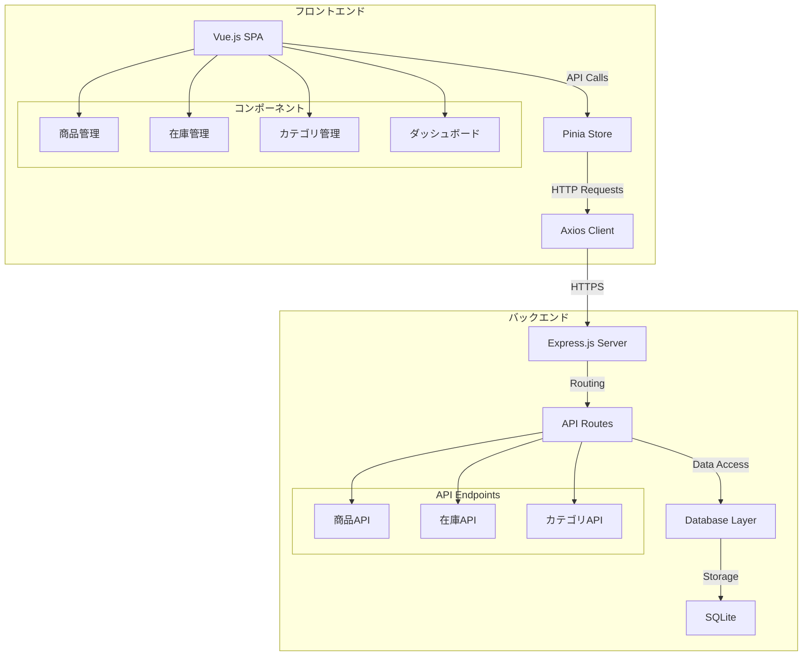

# 在庫管理システム

## 概要

シンプルな在庫管理システムです。商品の登録、在庫数の管理、在庫状況の可視化などの機能を提供します。

## 主な機能

- 商品管理（登録・編集・削除）
- 在庫数管理
  - 入出庫管理
  - 在庫履歴の記録
- カテゴリ管理
  - カテゴリの作成・編集・削除
  - カテゴリ別商品一覧
- ダッシュボード
  - 総在庫数の表示
  - 商品数の表示
  - 総在庫金額の表示
- SKU（在庫管理番号）による商品管理

## 技術スタック

### フロントエンド

- Vue.js 3 (Composition API)
- TypeScript
- Vite (開発環境・ビルドツール)
- Tailwind CSS (スタイリング)
- Pinia (状態管理)
- Vue Router (ルーティング)
- Heroicons (アイコン)
- Headless UI (UI コンポーネント)

### バックエンド

- Node.js
- Express (Web フレームワーク)
- SQLite (データベース)
- better-sqlite3 (SQLite クライアント)
- Zod (バリデーション)

## システム構成図



## データベース設計

詳細は[ER 図](./docs/er-diagram.md)を参照してください。

## API 仕様

詳細は[API 仕様書](./docs/api-spec.md)を参照してください。

## セットアップ方法

### 前提条件

- Node.js 18 以上
- npm 9 以上

### フロントエンド

```bash
# 依存関係のインストール
npm install

# 開発サーバーの起動
npm run dev
```

### バックエンド

```bash
cd backend

# 依存関係のインストール
npm install

# 開発サーバーの起動
npm run dev
```

## 環境変数

### フロントエンド (.env)

```
VITE_API_URL=http://localhost:3000/api
```

### バックエンド (.env)

```
PORT=3000
DATABASE_URL=file:./inventory.db
```

## デプロイ

### フロントエンド (Netlify)

1. GitHub リポジトリと連携
2. ビルド設定:
   - Build command: `npm run build`
   - Publish directory: `dist`
3. 環境変数の設定:
   - `VITE_API_URL`: バックエンドの URL

### バックエンド (Render)

1. GitHub リポジトリと連携
2. Web Service として作成
3. 環境変数の設定:
   - `NODE_ENV`: production
   - `PORT`: 自動設定
