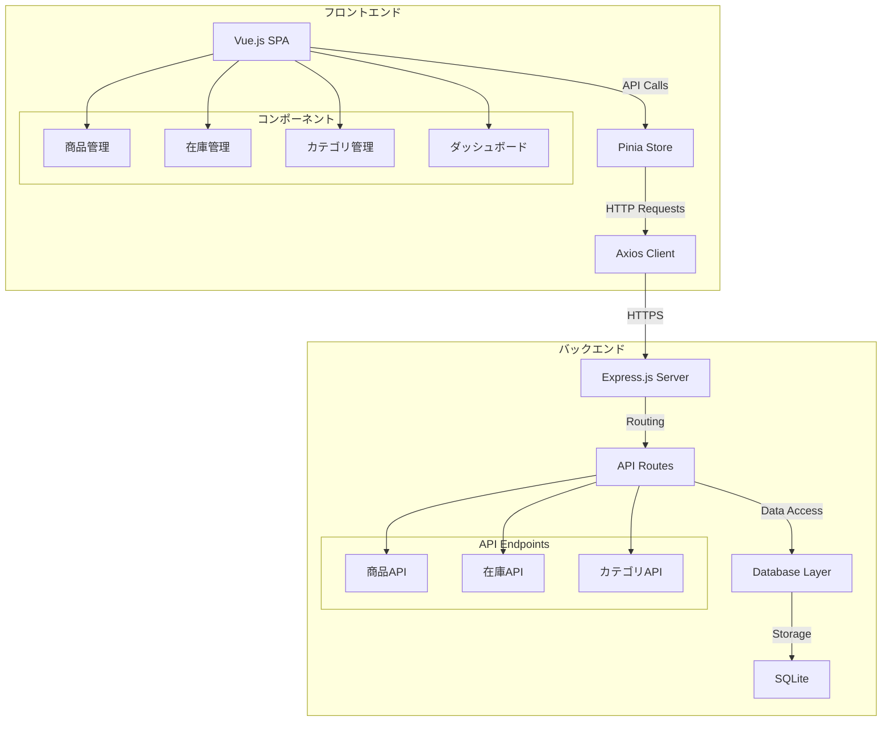

```mermaid
graph TB
    subgraph "フロントエンド"
        A[Vue.js SPA] --> |API Calls| B[Pinia Store]
        B --> |HTTP Requests| C[Axios Client]
        
        subgraph "コンポーネント"
            D[商品管理]
            E[在庫管理]
            F[カテゴリ管理]
            G[ダッシュボード]
        end
        
        A --> D & E & F & G
    end
    
    subgraph "バックエンド"
        H[Express.js Server] --> |Routing| I[API Routes]
        I --> |Data Access| J[Database Layer]
        J --> |Storage| K[SQLite]
        
        subgraph "API Endpoints"
            L[商品API]
            M[在庫API]
            N[カテゴリAPI]
        end
        
        I --> L & M & N
    end
    
    C --> |HTTPS| H
```