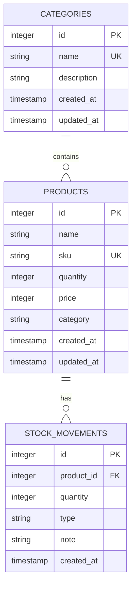

# データベース設計

```mermaid
erDiagram
    PRODUCTS {
        integer id PK
        string name
        string sku UK
        integer quantity
        integer price
        string category
        timestamp created_at
        timestamp updated_at
    }

    CATEGORIES {
        integer id PK
        string name UK
        string description
        timestamp created_at
        timestamp updated_at
    }

    STOCK_MOVEMENTS {
        integer id PK
        integer product_id FK
        integer quantity
        string type
        string note
        timestamp created_at
    }

    PRODUCTS ||--o{ STOCK_MOVEMENTS : has
    CATEGORIES ||--o{ PRODUCTS : contains
```